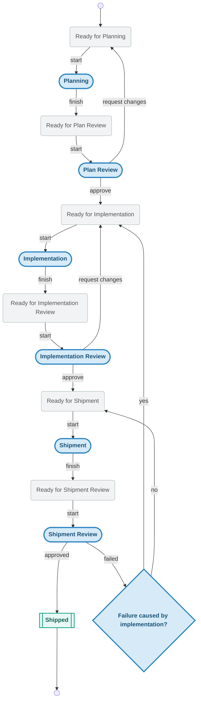

# Knots

[![CI][ci-badge]][ci-url]
[![Coverage][coverage-badge]][coverage-url]
[![License: MIT][license-badge]][license-url]
[](https://discord.gg/KPgNPMAzrP)

Knots is a local-first, git-backed system for helping humans and agents understand what they did, what they are doing, and what they plan to do next. It uses append-only events plus a SQLite cache to stay fast locally while remaining syncable through git.

## Install

The installer pulls from GitHub Releases and installs to `${HOME}/.local/bin` by default.

```bash
curl -fsSL https://raw.githubusercontent.com/acartine/knots/main/install.sh | sh
```

## Why Knots

Knots is intentionally a lighter, thinner descendant of [Beads](https://github.com/steveyegge/beads?tab=readme-ov-file).

Beads opened up a powerful way to think about structured memory, workflow, and human/agent collaboration. Knots keeps that lineage, but aims for a simpler local-first shape: fast CLI workflows, repo-native data, opinionated queue/action transitions, and less dependence on a larger orchestration platform.

A knot is not just a unit of work. It is a unit of coordination and understanding. A knot can represent work, but it can also represent a gate, and future versions may grow other kinds such as agents or teams. The point is to keep a durable record of what matters to humans and agents as they move through a process.

## Basic Concepts

### Actions and Queues

Each step of the workflow is either an action state or a queue state.

- **Action states** mean something is actively being worked.
- **Queue states** mean something is ready to be picked up by the next responsible actor.

That split keeps it obvious what is in progress, what is waiting, and what should happen next.
Some workflows also define **passive escape states** such as `blocked` or
`deferred`. Those states are non-terminal waiting states: they are not
claimable work, and they do not imply that the knot is done.

### Profiles

#### Action ownership and output

Knots provides one core workflow with multiple profiles. A profile assigns ownership to actions and, in some cases, defines what a step is expected to produce.

For example, an Implementation Review step can be human-gated, and its review target might be a branch, a PR, or a merged commit. That gives you fine-grained control over what agents are allowed to do and what counts as done.

#### Knot-level profiles

Different knots can use different profiles. A small patch might skip planning and review, while a larger feature can go through the full workflow.

## The Workflow


## Quick Start

If you only want the shortest path to seeing Knots work, it is this:

1. `kno init`
2. `kno new "fix foo" --desc "The foo module panics on empty input"`
3. `kno poll --claim`
4. do the work described in the prompt
5. run the `kno next ...` command printed in the prompt

The fuller walkthrough is below.

### 1. Initialize Knots in your repo

```bash
$ kno init
```
```
═══════════════════════════════════════════
  FIT TO BE TIED 🎉
═══════════════════════════════════════════
  ▸ initializing local store
  ▸ opening cache database at .knots/cache/state.sqlite
  ▸ ensuring gitignore includes .knots rule
  ✔ local store initialized
  ▸ initializing remote branch origin/knots
  ⋯ this can take a bit...
  ✔ remote branch origin/knots initialized
```

This creates the `.knots/` directory, initializes the SQLite cache, adds `.knots/` to `.gitignore`, and sets up the `origin/knots` tracking branch.

`kno init` is also how you onboard to a repo that already uses Knots. If a project's README says it uses Knots, just run `kno init` in your clone. Instead of creating a new remote tracking branch, it will detect the existing `origin/knots` branch and sync you with the latest Knots data.

### 2. Create a knot

```bash
$ kno new "fix foo" --desc "The foo module panics on empty input"
```
```
created abc123 ready_for_planning fix foo
```

The knot enters the first queue state (`ready_for_planning`) and is immediately available for the next responsible actor to pick up — often an agent, but not necessarily.

### 3. Claim the next thing

```bash
$ kno poll --claim
```
```
# fix foo

**ID**: abc123  |  **Priority**: 3  |  **Type**: work
**Profile**: autopilot  |  **State**: planning

## Description

The foo module panics on empty input

---

# Planning

## Input
- Knot in `ready_for_planning` state
- Knot title, description, and any existing notes/context

## Actions
1. Analyze the knot requirements and constraints
2. Research relevant code, dependencies, and prior art
3. Draft an implementation plan with steps, file changes, and test strategy
4. Estimate complexity and identify risks
5. Write the plan as a knot note via `kno update <id> --add-note "<plan>"`
6. Create a hierarchy of knots via `kno new "<title>"` for parent knots, `kno q "title"` for child knots and `kno edge <id> parent_of <id>` for edges

## Output
- Detailed implementation plan attached as a knot note
- Hierarchy of knots created
- Transition:
  ```bash
  kno next <id> --expected-state <currentState> --actor-kind agent \
    --agent-name <AGENT_NAME> --agent-model <AGENT_MODEL> \
    --agent-version <AGENT_VERSION>
  ```

## Failure Modes
- Insufficient context: `kno update <id> --status ready_for_planning --add-note "<note>"`
- Out of scope / too complex: `kno update <id> --status ready_for_planning --add-note "<note>"`
```

`poll --claim` atomically grabs the highest-priority claimable item, transitions it from a queue state to its action state, and prints a self-contained prompt. The output includes the knot context, the instructions for the current step, and the exact command to run when that step is done.

### 4. Advance to the next state

When the current actor finishes the step, run the completion command from the prompt:

```bash
$ kno next abc123 --expected-state planning --actor-kind agent \
  --agent-name my-agent --agent-model my-model \
  --agent-version 1.0.0
```
```
updated abc123 -> ready_for_plan_review
```

The knot moves to the next queue state, where it waits for the next action to be claimed.

### Repeat

For an automated worker, the loop is just two commands:

```bash
while true; do
  kno poll --claim || { sleep 30; continue; }
  # ... do the work described in the prompt ...
  # ... run the completion command from the output ...
done
```

Each iteration claims work, executes it, and advances the knot through the workflow until it reaches `shipped`.

## Agent Integration

### Poll and Claim

`poll` and `claim` are the primary agent interface. CLI stdout is the prompt delivery mechanism — no file injection, no hooks, and no agent-specific API required.

```bash
kno poll                       # peek at the top claimable knot
kno poll implementation        # filter to a specific stage
kno poll --owner human         # show human-owned stages instead
kno poll --claim               # atomically grab the top item
kno poll --claim --json        # machine-readable output
kno claim <id>                 # claim a specific knot by id
kno claim <id> --json          # machine-readable claim
kno claim <id> --peek          # preview without advancing state
```

Agent metadata is recorded on each claim:
```bash
kno claim <id> \
  --agent-name "claude-code" \
  --agent-model "opus-4" \
  --agent-version "1.0"
```

### Step metadata for downstream consumers

Downstream tools can read stable routing metadata from both live knot views and
persisted knot-head events.

- `kno show <id> --json` returns `step_metadata` for the current state and
  `next_step_metadata` for the next happy-path state.
- `kno ls --json` includes the same fields on each listed knot.
- `.knots/index/.../idx.knot_head.json` persists the same metadata in event
  logs for replay or external ingestion.

Each metadata object has a stable shape:

```json
{
  "action_state": "implementation_review",
  "action_kind": "review",
  "owner": { "kind": "human" },
  "output": {
    "artifact_type": "approval",
    "access_hint": "git log"
  },
  "review_hint": "Check tests pass and coverage meets threshold"
}
```

Use `owner.kind` to route the current or next action to a human or agent,
`output.artifact_type` and `output.access_hint` to decide what artifact a step
should produce, and `review_hint` to tell reviewers what to inspect.

## Leases

A lease is a session token automatically created when an agent claims a knot and
terminated when the agent advances (`kno next`). Every claim gets its own
dedicated lease — they are never shared. Leases block sync (push/pull) while
active, preventing in-progress work from replicating to other machines.

Leases expire after a configurable timeout (default: 10 minutes). Write commands
that touch a bound knot automatically refresh the timer. Expired leases are
lazily terminated on the next interaction and unblock sync.

For full lifecycle details, timeout configuration, extension, and manual
management commands see [docs/leases.md](docs/leases.md).

## Execution Plans

Use the `execution_plan` knot type when the knot itself is coordinating other
knots. Its structure is intentionally simple:

- waves run in sequence
- steps within a wave run in sequence
- knots attached to the same step are intended to be executable concurrently

For the full taxonomy, examples, and a CLI walkthrough that builds a plan from
scratch, see [docs/execution-plans.md](docs/execution-plans.md).

## JSON output

Both commands support `--json` for programmatic consumption:

```json
{
  "id": "K-abc123",
  "title": "fix foo",
  "state": "planning",
  "priority": 3,
  "type": "work",
  "profile_id": "autopilot",
  "prompt": "# fix foo\n\n**ID**: abc123 ..."
}
```

## Consumption patterns

**Any agent runtime** (the command output IS the prompt):
```bash
kno poll --claim | agent-runner --prompt -
```

**Programmatic (Python, SDK, etc.)**:
```python
result = subprocess.run(["kno", "poll", "--claim", "--json"],
                        capture_output=True)
item = json.loads(result.stdout)
agent.run(prompt=item["prompt"])
```

### Managed Skills

Knots can install its managed `knots`, `knots-e2e`, `knots-create`, and
`knots-plan-orchestrator` skills for supported agent tools:

```bash
kno skills install codex
kno skills install claude
kno skills install opencode
```

Claude support is project-level only at `./.claude/skills`. OpenCode installs
to the project root when `./.opencode/` exists; otherwise it falls back to the
supported user-level root. `kno doctor` checks whether those expected skills
are present and reports missing setup with the exact `SKILL.md` paths.

**CI/CD**:
```yaml
- run: |
    WORK=$(kno poll --json)
    if [ -n "$WORK" ]; then
      kno claim $(echo $WORK | jq -r .id) --json | agent-runner
    fi
```

## Other Commands

### Verify install
```bash
kno --version
```

### Update installed binary
```bash
kno upgrade
kno upgrade --version v0.2.0
```

### Uninstall installed binary
```bash
kno uninstall
kno uninstall --remove-previous
```

## Core usage

### Create a knot
```bash
kno new "Document release pipeline" --state ready_for_implementation
kno new "Triage regression"                  # uses repo default profile
kno new "Hotfix gate" --profile semiauto
```

### Update state
```bash
kno state <knot-id> implementation
```

### Advance or rewind workflow state
```bash
kno next <knot-id> implementation
kno rollback <knot-id>
kno rb <knot-id> --dry-run
```

`rollback` moves action states back to the prior ready state; for example,
`implementation_review` rewinds to `ready_for_implementation`.

### Patch fields with one command
```bash
kno update <knot-id> \
  --title "Refine import reducer" \
  --description "Carry full migration metadata" \
  --priority 1 \
  --status implementation \
  --type work \
  --add-tag migration \
  --add-note "handoff context" \
  --note-username acartine \
  --note-datetime 2026-02-23T10:00:00Z \
  --note-agentname codex \
  --note-model gpt-5 \
  --note-version 0.1
```

### List and inspect
```bash
kno ls
kno ls               # shipped knots hidden by default
kno ls --all         # include shipped knots
kno ls --state implementation --tag release
kno ls --profile semiauto
kno ls --type work --query importer
kno show <knot-id>
kno show <knot-id> --json
```

### Sync from the dedicated `knots` branch/worktree
```bash
kno sync
```

### Manage dependency edges
```bash
kno edge add <src-id> blocked_by <dst-id>
kno edge list <src-id> --direction outgoing
kno edge remove <src-id> blocked_by <dst-id>
```

Import supports parity fields when present:
- `description`, `priority`, `issue_type`/`type`
- `labels`/`tags`
- `notes` as legacy string or structured array entries
- `handoff_capsules` structured array entries

# SQLite concurrency requirements
Knots uses SQLite in WAL mode with a busy timeout, and concurrency must follow these rules:

- Queue and serialize write operations so only one writer mutates the cache at a time.
- Allow read operations to execute immediately; reads must not be queued behind writes.
- Keep `PRAGMA journal_mode=WAL` enabled to preserve snapshot reads during writes.
- Keep `PRAGMA busy_timeout` configured and treat `SQLITE_BUSY`/`SQLITE_LOCKED` as retryable.
- Add bounded write retries with jittered backoff.
- Keep write transactions short; avoid long-lived write locks.
- For commands requiring strict read-after-write freshness, run the read after
  the queued write commits.

Implementation note:
- Current cache setup is in [`src/db.rs`](src/db.rs)
  (`journal_mode=WAL`, `busy_timeout=5000`).

# Developing
For information on the release process and local development testing, see
[CONTRIBUTING.md](CONTRIBUTING.md).


## Security and support
- Security policy: see `SECURITY.md`
- Non-security bugs/feature work: open a normal GitHub issue
- Installation/release regressions: open issue with logs and platform details

### Enable private vulnerability reporting (GitHub)
After publishing the repository:
1. Open repository `Settings`.
2. Open `Security & analysis`.
3. Enable `Private vulnerability reporting`.
4. Confirm `SECURITY.md` is discoverable from the repository root.

## License
MIT. See `LICENSE`.

[ci-badge]: https://github.com/acartine/knots/actions/workflows/ci.yml/badge.svg
[ci-url]: https://github.com/acartine/knots/actions/workflows/ci.yml
[coverage-badge]: https://codecov.io/gh/acartine/knots/graph/badge.svg?branch=main
[coverage-url]: https://codecov.io/gh/acartine/knots
[license-badge]: https://img.shields.io/badge/License-MIT-yellow.svg
[license-url]: https://opensource.org/licenses/MIT
