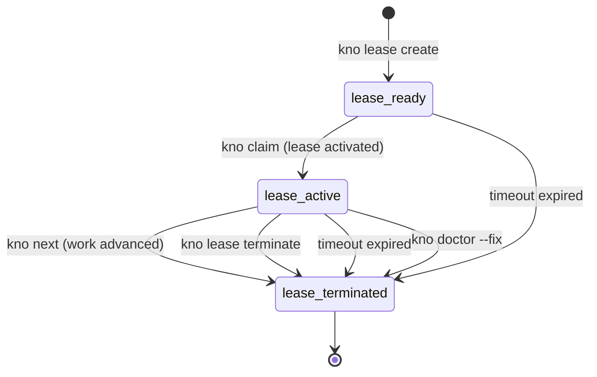
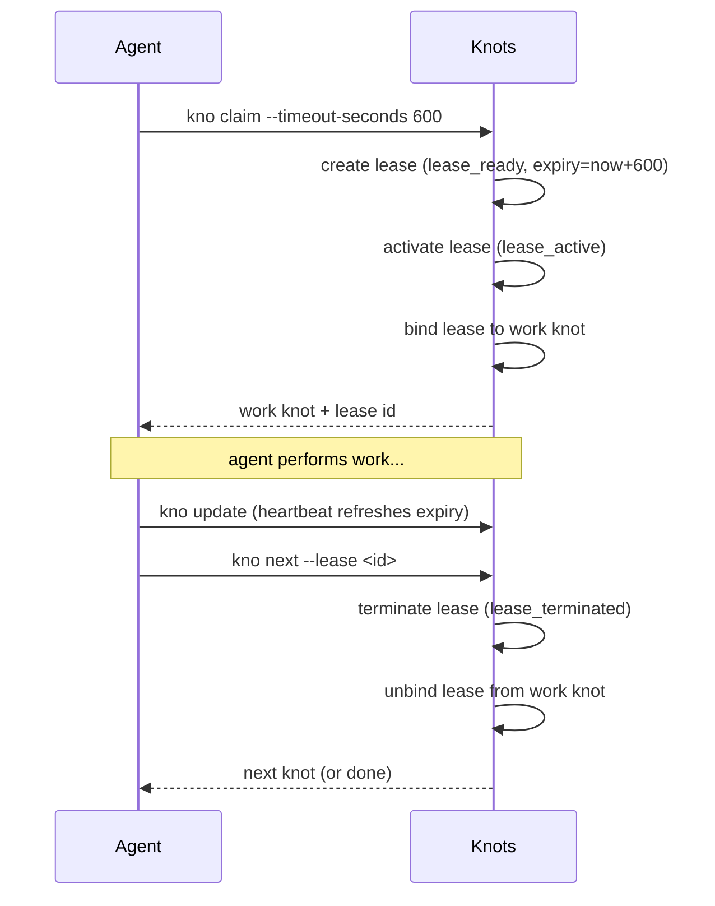
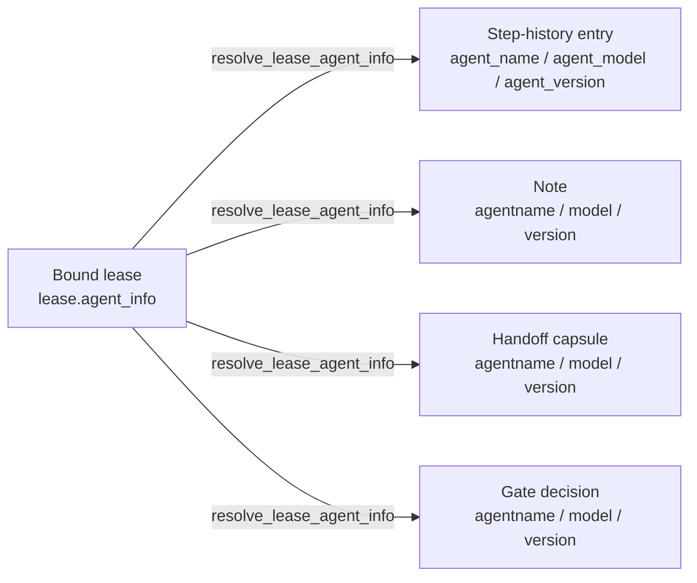

# Leases

A **lease** is a session token that is automatically created when an agent claims
a knot and terminated when the agent advances to the next step. Leases exist to
answer a simple question: _is anyone actively working on this right now?_

Every claim gets its own lease. There is no sharing or reuse across claims.

## Why leases exist

- **Concurrency safety** -- sync (push/pull) is blocked while a lease is active,
  preventing partial in-progress work from replicating to other machines.
- **Session auditing** -- leases record which agent (name, model, version) held a
  claim, giving a durable audit trail of who did what.
- **Stuck-work detection** -- leases expire after a configurable timeout. Expired
  leases unblock sync automatically and are cleaned up on the next interaction.

## Lifecycle

Each lease moves through three states. Expiry can terminate a lease from either
`lease_ready` or `lease_active`:



### States

| State | Meaning |
|-------|---------|
| `lease_ready` | Created; waiting to be activated via claim |
| `lease_active` | Claim is live; sync is blocked; work is in progress |
| `lease_terminated` | Completed, expired, or abandoned; sync is unblocked |

## Timeout and expiry

Every lease has an expiry timestamp set at creation. The default timeout is
**600 seconds (10 minutes)**, configurable via `--timeout-seconds`:

```bash
kno lease create --nickname "session" --timeout-seconds 900   # 15 min
kno claim <id> --lease <lease-id> --timeout-seconds 1800      # 30 min
```

### Heartbeat

Any write command that touches a bound knot (`kno update`) automatically
refreshes the lease expiry. Agents that are actively working don't need to
explicitly extend -- each interaction resets the timer.

### Explicit extension

Agents that need more time without touching the knot can extend directly:

```bash
kno lease extend --lease-id <id>                     # reset to 10 min
kno lease extend --lease-id <id> --timeout-seconds 1800  # 30 min
```

### Lazy materialization

Expired leases are not terminated by a background timer. Instead, expiry is
checked whenever any code path reads a lease. When an expired lease is
detected:

1. The lease state is written to `lease_terminated` in the database.
2. The lease is unbound from the work knot.
3. The knot is rolled back to its previous queue state.
4. Sync is unblocked.

This means an expired lease may briefly appear active in the database until
the next interaction triggers materialization.

## One lease per claim

Each `kno claim` call creates and activates a dedicated lease for that knot.
Leases are never shared between claims. When the claim completes via
`kno next`, the lease is terminated and the binding is removed.



## Graceful completion with expired leases

If an agent calls `kno next` with an expired lease **and** nobody else has
claimed the knot, the progression is allowed. This prevents wasting work when
the only issue is a timeout -- the agent finished, just a bit late.

If another agent has already reclaimed the knot, the original agent's `kno next`
will fail with an instructive error.

## Lease identifiers

Lease IDs are returned at claim time for use with `--lease` on `kno next` and
`kno lease extend`. Standard output (`kno show`, `kno ls`) does not include
lease identifiers to prevent external callers from hijacking sessions.

You can inspect leases directly with `kno lease ls` and `kno lease show <id>`.

## Stuck lease recovery

```bash
kno doctor          # report stuck/expired leases
kno doctor --fix    # terminate all, unbind knots, unblock sync
```

## Manual lease management

In most workflows leases are fully automatic. Manual commands exist for
inspection, debugging, and recovery:

```bash
# Inspect
kno lease ls                  # active leases only
kno lease ls --all            # include terminated
kno lease ls --json
kno lease show <id>
kno lease show <id> --json

# Create an external lease (advanced)
kno lease create --nickname "my-session" --type agent \
    --agent-name claude --model opus --model-version 4.6 \
    --timeout-seconds 1800
kno lease create --nickname "manual-fix" --type manual

# Extend
kno lease extend --lease-id <id>
kno lease extend --lease-id <id> --timeout-seconds 1800

# Terminate
kno lease terminate <id>
```

An external lease can be passed to a claim via `--lease <id>`, which activates
the pre-created lease instead of creating a new one:

```bash
kno claim <knot-id> --lease <lease-id> --timeout-seconds 900
```

## Agent identity propagation

The lease is the **declared source of agent identity** (name, model,
version, provider, agent type) on a claimed knot. Identity is supplied
exactly once, at `kno lease create`, and travels with the lease for the
rest of the claim. Knots reads the bound lease's `agent_info` and stamps
it onto every record produced while the lease is active.

### The rule

`kno lease create` is the **only** subcommand that accepts agent identity
flags. On every other subcommand, the agent-identity flags are
**deprecated and ignored at runtime**. Specifically:

- `--agent-name`, `--agent-model`, `--agent-version` on `kno claim`,
  `kno poll --claim`, `kno next`, `kno rollback`, `kno gate evaluate`,
  and `kno step annotate`.
- `--note-agentname`, `--note-model`, `--note-version` on
  `kno update --add-note`.
- `--handoff-agentname`, `--handoff-model`, `--handoff-version` on
  `kno update --add-handoff-capsule`.

These flags are still **accepted syntactically** so legacy callers do not
break. Their values are **discarded**; identity comes from the bound
lease's `agent_info`. A future release will reject the flags outright.

`--actor-kind` (`agent` vs `human`) is orthogonal to agent identity and is
unaffected by this rule. Continue to pass `--actor-kind` where the CLI
accepts it.

### Deprecation warning

Whenever a deprecated agent-identity flag is supplied on a non-lease-create
subcommand, Knots writes a three-line warning to stderr:

1. The flag is deprecated and will be rejected in a future release.
2. Its value is ignored on this subcommand — identity is read from the
   bound lease.
3. If no lease is bound, create one via
   `kno lease create --agent-name ... --model ... --model-version ...` and
   pass `--lease <id>` on claim.

The warning is informational: the command still runs. The offending flag
has no effect on the record Knots writes.

### Contract for a Knots Client

A *Knots Client* is any automated system driving `kno` on behalf of an
agent (as opposed to a human at an interactive shell). A Knots Client
declares identity by creating a lease:

```bash
lease_id=$(kno lease create --nickname "my-session" --type agent \
    --agent-name <name> --model <model> --model-version <version> \
    --provider <provider> --agent-type <type> --json | jq -r .id)
kno claim <knot-id> --lease "$lease_id"
```
Or in PowerShell:
```powershell
$lease = kno lease create --nickname "my-session" --type agent `
    --agent-name <name> --model <model> --model-version <version> `
    --provider <provider> --agent-type <type> --json | ConvertFrom-Json
kno claim <knot-id> --lease $lease.id
```

All subsequent `kno` calls within that claim operate on the bound lease
and MUST NOT pass agent-identity flags. The deprecation warning above is
the feedback loop for clients that still do.

### What Knots stamps from the lease

When a knot has a bound lease, Knots reads the lease's `agent_info` and
stamps it onto records produced by the active claim:

| Record | Fields stamped | Trigger |
|---|---|---|
| Note | `agentname`, `model`, `version`, `username` | `kno update --add-note` |
| Handoff capsule | `agentname`, `model`, `version`, `username` | `kno update --add-handoff-capsule` |
| Step-history entry (claim/transition) | `agent_name`, `agent_model`, `agent_version` | `kno claim`, `kno poll --claim`, `kno next` |
| Step-history entry (rollback) | `agent_name`, `agent_model`, `agent_version` | `kno rollback` |
| Gate decision metadata | `agentname`, `model`, `version` | `kno gate evaluate` |

Lookup is performed by `resolve_lease_agent_info` in
[`src/write_dispatch/helpers.rs`](../src/write_dispatch/helpers.rs): given a
knot id, Knots reads the knot's currently bound `lease_id`, loads the
lease, and returns its `agent_info`. If no lease is bound, these fields
stay unset on the record.



Identity travels with the artifact for the rest of its life. Once stamped,
the fields are part of the record and don't need to be looked up again.

### Contract for clients

Clients (Foolery, scripts, future automation) MUST treat the lease as
authoritative for the duration of the claim:

1. **Declare once.** Pass the agent identity to `kno lease create` and only
   to `kno lease create`.
2. **Refer by id.** Pass `--lease <id>` on `kno claim` / `kno poll --claim`
   / `kno next` / `kno lease extend`. Never pass `--agent-*` flags on
   those subcommands.
3. **Read, don't re-derive.** When a client needs to display "what agent
   is on this knot right now," it reads the lease (`kno lease show
   <id> --json`) or the knot's most recent step / note / handoff capsule.
   It does not re-parse a model string from the environment, the agent's
   binary version, or any other ambient state.
4. **No fallbacks.** If `resolve_lease_agent_info` returns `None` for a
   record, the artifact's agent fields are left unset. Clients must not
   substitute literals like `"claude"` or `"unknown"`; the absence of
   identity is itself information.

Foolery's client-side companion contract is at
[`foolery/docs/knots-agent-identity-contract.md`](https://github.com/acartine/foolery/blob/main/docs/knots-agent-identity-contract.md).
The two documents must agree.

## Known limitations

- **Expired lease + reclaimed knot = wasted work.** If a lease expires and
  another agent claims the knot before the original agent finishes, the
  original agent's in-flight work is lost. This is an accepted tradeoff;
  choosing a longer timeout or using heartbeat-producing commands mitigates it.
