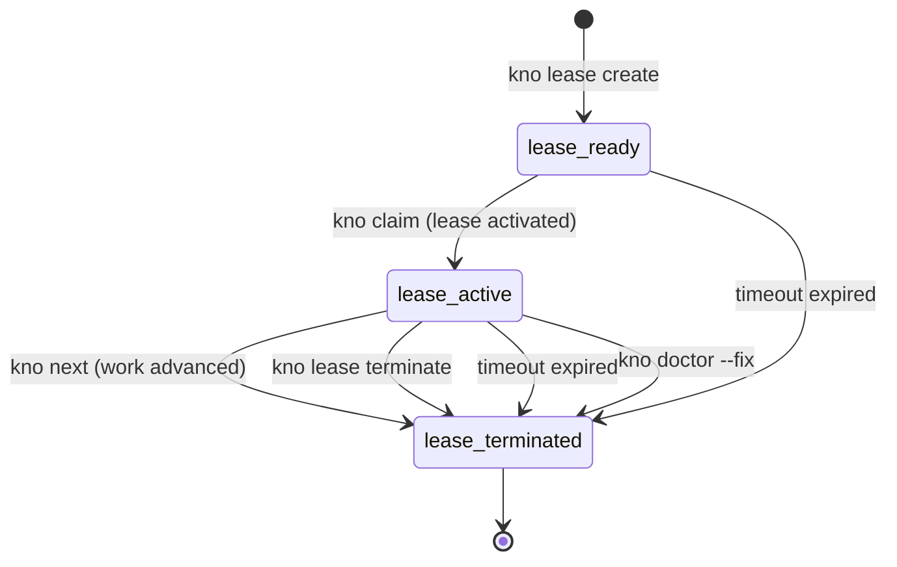
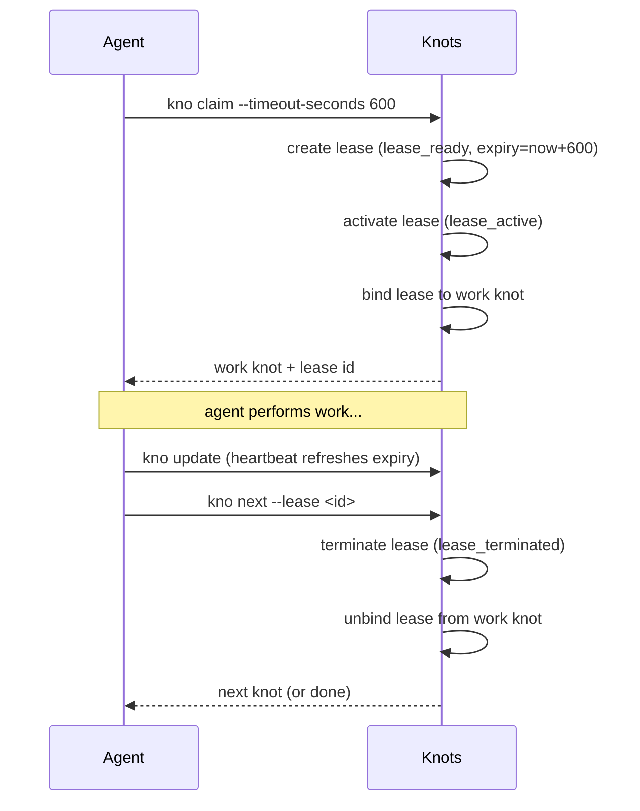

# Leases

A **lease** is a session token that is automatically created when an agent claims
a knot and terminated when the agent advances to the next step. Leases exist to
answer a simple question: _is anyone actively working on this right now?_

Every claim gets its own lease. There is no sharing or reuse across claims.

## Why leases exist

- **Concurrency safety** -- sync (push/pull) is blocked while a lease is active,
  preventing partial in-progress work from replicating to other machines.
- **Session auditing** -- leases record which agent (name, model, version) held a
  claim, giving a durable audit trail of who did what.
- **Stuck-work detection** -- leases expire after a configurable timeout. Expired
  leases unblock sync automatically and are cleaned up on the next interaction.

## Lifecycle

Each lease moves through three states. Expiry can terminate a lease from either
`lease_ready` or `lease_active`:



### States

| State | Meaning |
|-------|---------|
| `lease_ready` | Created; waiting to be activated via claim |
| `lease_active` | Claim is live; sync is blocked; work is in progress |
| `lease_terminated` | Completed, expired, or abandoned; sync is unblocked |

## Timeout and expiry

Every lease has an expiry timestamp set at creation. The default timeout is
**600 seconds (10 minutes)**, configurable via `--timeout-seconds`:

```bash
kno lease create --nickname "session" --timeout-seconds 900   # 15 min
kno claim <id> --lease <lease-id> --timeout-seconds 1800      # 30 min
```

### Heartbeat

Any write command that touches a bound knot (`kno update`) automatically
refreshes the lease expiry. Agents that are actively working don't need to
explicitly extend -- each interaction resets the timer.

### Explicit extension

Agents that need more time without touching the knot can extend directly:

```bash
kno lease extend --lease-id <id>                     # reset to 10 min
kno lease extend --lease-id <id> --timeout-seconds 1800  # 30 min
```

### Lazy materialization

Expired leases are not terminated by a background timer. Instead, expiry is
checked whenever any code path reads a lease. When an expired lease is
detected:

1. The lease state is written to `lease_terminated` in the database.
2. The lease is unbound from the work knot.
3. The knot is rolled back to its previous queue state.
4. Sync is unblocked.

This means an expired lease may briefly appear active in the database until
the next interaction triggers materialization.

## One lease per claim

Each `kno claim` call creates and activates a dedicated lease for that knot.
Leases are never shared between claims. When the claim completes via
`kno next`, the lease is terminated and the binding is removed.



## Graceful completion with expired leases

If an agent calls `kno next` with an expired lease **and** nobody else has
claimed the knot, the progression is allowed. This prevents wasting work when
the only issue is a timeout -- the agent finished, just a bit late.

If another agent has already reclaimed the knot, the original agent's `kno next`
will fail with an instructive error.

## Lease identifiers

Lease IDs are returned at claim time for use with `--lease` on `kno next` and
`kno lease extend`. Standard output (`kno show`, `kno ls`) does not include
lease identifiers to prevent external callers from hijacking sessions.

You can inspect leases directly with `kno lease ls` and `kno lease show <id>`.

## Stuck lease recovery

```bash
kno doctor          # report stuck/expired leases
kno doctor --fix    # terminate all, unbind knots, unblock sync
```

## Manual lease management

In most workflows leases are fully automatic. Manual commands exist for
inspection, debugging, and recovery:

```bash
# Inspect
kno lease ls                  # active leases only
kno lease ls --all            # include terminated
kno lease ls --json
kno lease show <id>
kno lease show <id> --json

# Create an external lease (advanced)
kno lease create --nickname "my-session" --type agent \
    --agent-name claude --model opus --model-version 4.6 \
    --timeout-seconds 1800
kno lease create --nickname "manual-fix" --type manual

# Extend
kno lease extend --lease-id <id>
kno lease extend --lease-id <id> --timeout-seconds 1800

# Terminate
kno lease terminate <id>
```

An external lease can be passed to a claim via `--lease <id>`, which activates
the pre-created lease instead of creating a new one:

```bash
kno claim <knot-id> --lease <lease-id> --timeout-seconds 900
```

## Known limitations

- **Expired lease + reclaimed knot = wasted work.** If a lease expires and
  another agent claims the knot before the original agent finishes, the
  original agent's in-flight work is lost. This is an accepted tradeoff;
  choosing a longer timeout or using heartbeat-producing commands mitigates it.
