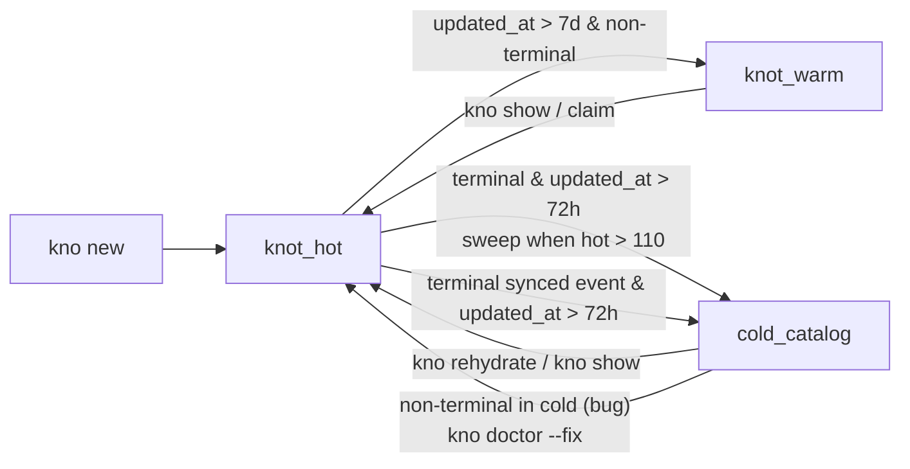
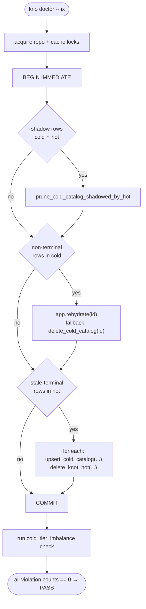

# Hot / Warm / Cold Tier Balance

Knots stores every knot in one of three SQLite-backed tiers. Each tier holds a
different amount of detail and a different slice of the catalog. The system is
designed so that, after a single `kno doctor --fix`, the tiers stay balanced
through every normal flow — sweep, sync, snapshot bootstrap — without ever
re-introducing the imbalance.

## The three tiers

- Hot (`knot_hot`): Recently active knots and recently terminated knots
  (<= 72h). Holds full body, gates, leases, plan data, history, and edges.
- Warm (`knot_warm`): Old non-terminal knots beyond the hot window. Holds
  `id` and `title` only.
- Cold (`cold_catalog`): Terminal knots (`shipped`, `abandoned`,
  `lease_terminated`) older than 72h. Holds `id`, `title`, `state`,
  and `updated_at`.

`HOT_TARGET = 100` and `HOT_HIGH_WATER = 110` (`src/app/archival.rs:26-30`)
control the *cold sweep*. They are not population floors — they are the band
that decides when archival kicks in.

## Tier invariants

A repo is in healthy tier balance when **all four** of the following hold:

1. **Disjointness.** No knot id appears in both `knot_hot` and `cold_catalog`.
2. **Cold is terminal-only.** Every `cold_catalog` row has a state in
   `TERMINAL_STATES = ["shipped", "abandoned", "lease_terminated"]`
   (`src/tiering.rs:10`).
3. **Cold has no recent-terminal rows.** No `cold_catalog` row has both a
   terminal state AND `updated_at >= now - ARCHIVE_AGE_HOURS`.
4. **Hot has no stale-terminal rows.** No `knot_hot` row has both a terminal
   state AND `updated_at < now - ARCHIVE_AGE_HOURS` (72h, `src/tiering.rs:15`).

The `cold_tier_imbalance` doctor check measures exactly these four conditions
— nothing more. A repo with `hot = 5` and `cold = 50` is *healthy* if those 50
cold rows are all terminal, all >72h old, and none of their ids leak into hot.

## Lifecycle of a knot



The only routes into cold gate on a terminal state. The only route out of cold
into hot is an explicit user/CLI rehydrate or a doctor fix. Cold is never the
"junk drawer" — it is the durable home for shipped work.

## The maintenance loop

```mermaid
sequenceDiagram
    participant U as User
    participant Sweep as run_cold_sweep
    participant Sync as sync::apply
    participant Snap as apply_latest_snapshots
    participant Hot as knot_hot
    participant Cold as cold_catalog

    U->>Sweep: kno ls (hot &gt; 110)
    Sweep->>Hot: select terminal &amp; updated_at &lt; now-72h
    Sweep->>Cold: upsert_cold_catalog(...)
    Sweep->>Hot: delete_knot_hot(...) (same tx)

    U->>Sync: kno sync
    Sync->>Sync: classify_knot_head_tier(state, updated_at, terminal)
    alt event is terminal and older than 72h
        Sync->>Hot: delete_knot_hot(...)
        Sync->>Cold: upsert_cold_catalog(...)
    else event is recent terminal or non-terminal hot
        Sync->>Cold: delete_cold_catalog(...)
        Sync->>Hot: upsert_knot_hot(...)
    end

    U->>Snap: bootstrap on fresh clone
    Snap->>Hot: replay active snapshot
    Snap->>Cold: replay cold snapshot
```

Every mover in the maintenance loop already enforces the invariants:

- `run_cold_sweep` filters by `is_terminal_state` (`src/app/archival.rs:94-113`)
  and pairs `upsert_cold_catalog` with `delete_knot_hot` inside one transaction
  (`src/app/archival.rs:131-159`). It cannot create a shadow row, cannot put a
  non-terminal row in cold, and *removes* stale-terminal rows from hot.
- `sync::apply::apply_index_event` (`src/sync/apply.rs:233-240`) deletes from
  hot before upserting cold whenever an event classifies as `Cold`.
  `terminal: true` is terminal evidence, but it still goes through the
  72-hour archive cutoff. Recent shipped work stays hot and list-visible.
- `apply_latest_snapshots` (`src/snapshots.rs:211-223`) replays whatever was
  written by a prior `write_snapshots_at_store`. As long as the source repo had
  the invariants, the destination does too — invariants are preserved across
  snapshot round-trips.

## How `kno doctor --fix` restores balance



Each pass is **idempotent**: running `--fix` a second time finds zero
violations and does nothing. After the first fix, the maintenance loop above
preserves all four invariants on every subsequent operation, so the next
`kno doctor` is `pass` — and stays `pass` through normal use.

## What used to go wrong

Before this design, `cold_tier_imbalance` warned whenever
`hot_count < 100 AND cold_count > 0`. That's the steady state of any repo with
fewer than ~110 active knots and any prior shipped work — i.e. nearly every
repo. `--fix` would rehydrate cold rows into hot to chase a population floor of
100, but:

- The next `kno sync` re-applied the original index events, which encode the
  *original* `updated_at`. Stale-terminal events classified back to cold,
  immediately undoing the fix.
- Any fresh clone re-applied `cold_catalog.snapshot.json`, repopulating cold
  from scratch.
- Rehydrate failures (events missing) were swallowed silently, leaving the cold
  row in place forever and the warn permanently lit.

The fix replaces a count comparison with the invariant checks listed
above. Cold is no longer treated as a problem to drain — it is treated as the
catalog's terminal-knot archive, which is exactly what it was always meant to
be.

## Reference

- Tier classifier: `src/tiering.rs`
- Cold sweep: `src/app/archival.rs`
- Sync tier routing: `src/sync/apply.rs`
- Doctor check + fix: `src/doctor_cold_tier.rs`
- DB helpers: `src/db/catalog.rs`
- Snapshots: `src/snapshots.rs`
